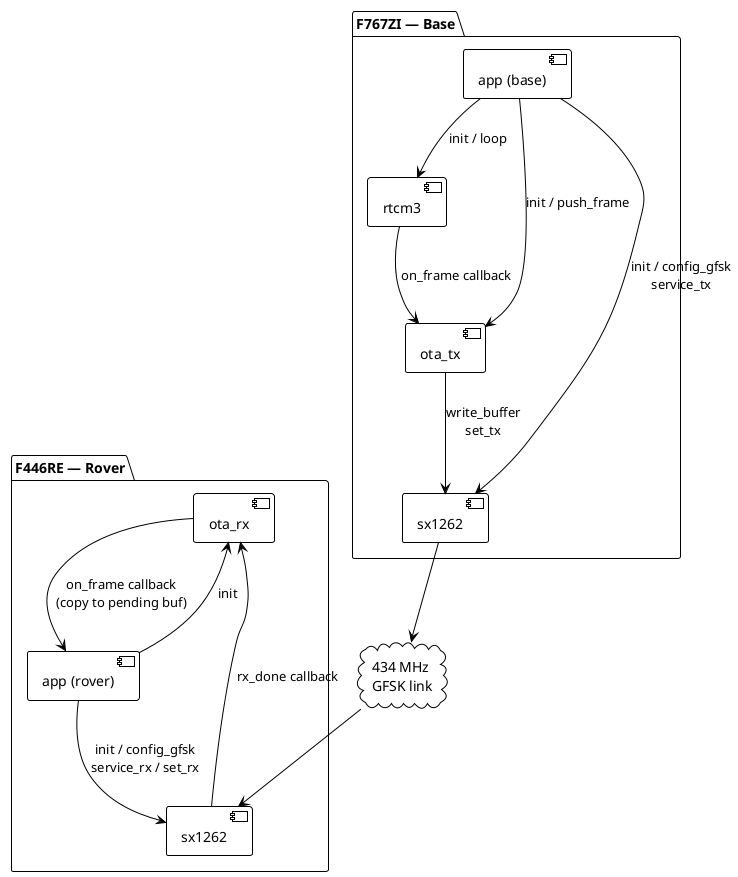

# GPS Staff — System Architecture

## Overview

The GPS survey staff is a two-unit RTK GNSS system.  A **base station** is
placed at a known (or surveyed-in) position; a **rover** is the handheld
staff.  The base receives RTCM3 correction data from its ZED-F9P GNSS module
and broadcasts it to the rover over a 434 MHz radio link.  The rover feeds
the corrections to its own ZED-F9P to achieve centimetre-level relative
accuracy.

The target hardware is a unified STM32F765VIT6 PCB (base and rover are
identical boards, configured by role at boot).  While that PCB is in design,
all firmware development runs on three Nucleo boards acting as bench stand-ins.

---

## Hardware Roles

| Board | Role | Key peripherals |
|---|---|---|
| Nucleo-G431KB | **Fake F9P** (bench stand-in for ZED-F9P) | UART1 @ 115200 — RTCM3 out (base mode) / in (rover mode) |
| Nucleo-F767ZI | **Base station** | UART2 @ 115200 RTCM3 in from G431; SPI2 → SX1262 GFSK TX |
| Nucleo-F446RE | **Rover** | SPI2 → SX1262 GFSK RX; UART3 @ 115200 RTCM3 out to G431 |

The two G431 boards talk directly to the two "big" boards over UART patch
cables, simulating the UART link that will exist between the ZED-F9P and the
STM32F765 on the finished PCB.

---

## System Data Flow

```plantuml
@startuml system-deployment
!include <archimate/Archimate>

skinparam {
  BackgroundColor #FAFAFA
  ArrowColor #555555
  NodeBorderColor #777777
}

Technology_Device(g431b, "Nucleo-G431KB\n(Fake F9P — Base)", "Cycles RTCM3 sample data\nat 1 Hz over UART")
Technology_Device(f767, "Nucleo-F767ZI\n(Base Station)", "STM32F767ZI @ 216 MHz\nrtcm3 + ota_tx + SX1262")
Technology_Device(f446, "Nucleo-F446RE\n(Rover)", "STM32F446RE @ 180 MHz\nota_rx + SX1262")
Technology_Device(g431r, "Nucleo-G431KB\n(Fake F9P — Rover)", "Verifies received RTCM3\nbyte-for-byte")

Rel_Flow_Right(g431b, f767, "RTCM3 frames\nUART 115200 8N1")
Rel_Flow_Right(f767, f446, "OTA chunks\nGFSK 434 MHz 50 kbps\n255-byte fixed packets")
Rel_Flow_Right(f446, g431r, "Reassembled RTCM3\nUART 115200 8N1")

@enduml
```

---

## Firmware Module Map



---

## OTA Packet Format (summary)

Every radio packet is exactly **255 bytes** (fixed-length GFSK).  The first
five bytes are a header; the remaining 250 carry RTCM3 payload bytes.  See
[ota-protocol.md](ota-protocol.md) for the full description.

| Byte | Field | Notes |
|---|---|---|
| 0 | `type` | `0x01` = RTCM3 chunk |
| 1 | `seq` | Frame sequence number, 0–255 wrapping |
| 2 | `chunk_idx` | 0-based chunk index within the frame |
| 3 | `chunk_count` | Total chunks for this frame |
| 4 | `data_len` | Valid RTCM3 bytes in this chunk (1–250) |
| 5–254 | `data` | RTCM3 payload bytes; last chunk zero-padded |

---

## Document Index

| Document | Contents |
|---|---|
| **[sx1262.md](sx1262.md)** | SX1262 driver — architecture, GFSK bring-up, interrupt model, full API |
| **[ota-protocol.md](ota-protocol.md)** | OTA protocol — packet format, ota_tx chunking, ota_rx reassembly, timing |
| **[rtcm3.md](rtcm3.md)** | rtcm3 module — RTCM3 frame format, state machine, buffer pool, IRQ/loop split |

---

## Current Bench State

- G431 Fake-F9P-Rover holds **SYNCED** indefinitely with zero accumulating
  mismatches at 1064 bytes/cycle (1005 + 1074 + 1084 + 1094 + 1124 bytes).
- The GFSK link operates at 434 MHz, 50 kbps, 25 kHz deviation — 7–8× less
  air time per cycle than the earlier LoRa SF7/BW500 configuration.
- `SX1262_WITH_LOGGING` is **disabled on the rover** (F446RE) to keep the
  post-reception blocking window short enough that a 434 MHz ISM interferer
  cannot displace a 1005-frame packet before `service_rx` reads it.  It
  remains enabled on the base (F767ZI) where the timing pressure is absent.
