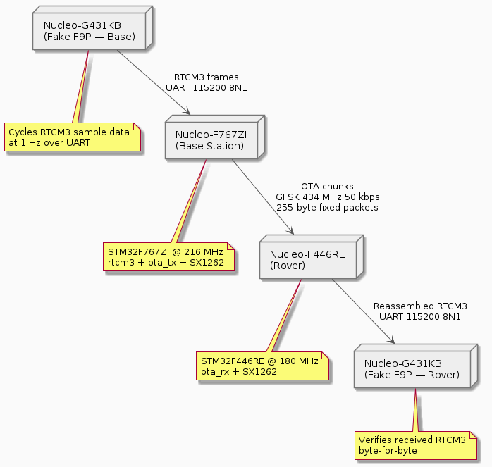
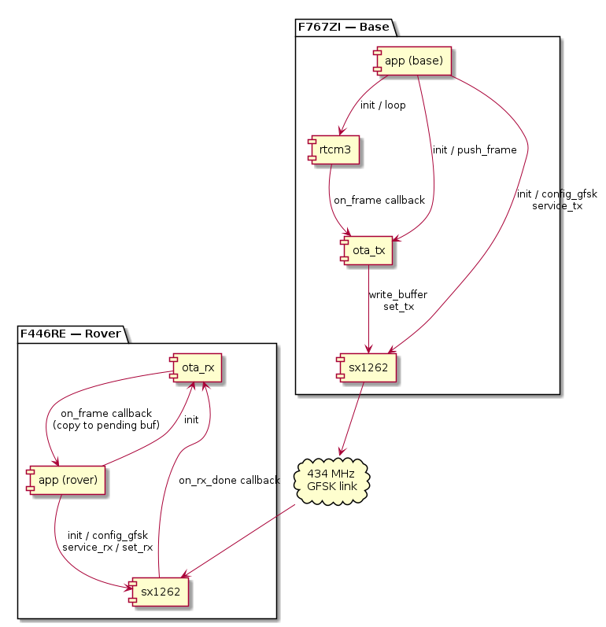

# GPS Staff — Firmware Architecture

## Overview

The GPS survey staff is a two-unit RTK GNSS system.  A **base station** is
placed at a known (or surveyed-in) position; a **rover** is the handheld
staff.  The base receives RTCM3 correction data from its ZED-F9P GNSS module
and broadcasts it to the rover over a 434 MHz radio link.  The rover feeds
the corrections to its own ZED-F9P to achieve centimetre-level relative
accuracy.

The target hardware is a unified STM32F765VIT6 PCB — **PCB v1.0 ordered
2026-06-25, ZED-F9P-05B ordered same date**.  Until hardware arrives, firmware
development runs on three Nucleo boards as bench stand-ins.

For system-level design decisions (component choices, data flow, unit roles)
see [`sdd/architecture/SYSTEM.md`](../../sdd/architecture/SYSTEM.md), which
includes the high-level block diagram ([system-overview.png](../../sdd/architecture/system-overview.png)).

---

## Bench Hardware Roles

| Board | Role | Key peripherals active |
|---|---|---|
| Nucleo-G431KB (×2) | **Fake F9P** — streams sample RTCM3 data from `firmware/data/` | UART1 @ 115200 — RTCM3 out (base mode) / in (rover mode) |
| Nucleo-F767ZI | **Base station** — bench-tethered, UART debug via PuTTY | UART2 @ 115200 RTCM3 in from G431; SPI2 → SX1262 GFSK TX; SDMMC SD card; I2C1 SSD1309 OLED |
| Nucleo-F446RE | **Rover** — portable, battery-powered, OLED-only UI | SPI2 → SX1262 GFSK RX; UART3 @ 115200 RTCM3 out to G431; I2C1 SSD1309 OLED |

The G431 boards talk to the "big" boards over UART patch cables, simulating
the UART link between the ZED-F9P and STM32F765 on the finished PCB.

---

## System Data Flow

> **ToDo:** `img/system-deployment.puml` and `img/firmware-modules.puml` were drawn against the
> Nucleo bench stand-in configuration. Both need to be redrawn once PCB v1.0 is in hand and the
> bench boards retire. The replacement high-level block diagram is
> [`sdd/architecture/system-overview.png`](../../sdd/architecture/system-overview.png).

---

## Firmware Module Map

---

## OTA Packet Format (summary)

Every radio packet is exactly **255 bytes** (fixed-length GFSK).  The first
five bytes are a header; the remaining 250 carry RTCM3 payload bytes.  See
[ota-protocol.md](ota-protocol.md) for the full description.

| Byte | Field | Notes |
|---|---|---|
| 0 | `type` | `0x01` = RTCM3 chunk |
| 1 | `seq` | Frame sequence number, 0–255 wrapping |
| 2 | `chunk_idx` | 0-based chunk index within the frame |
| 3 | `chunk_count` | Total chunks for this frame |
| 4 | `data_len` | Valid RTCM3 bytes in this chunk (1–250) |
| 5–254 | `data` | RTCM3 payload bytes; last chunk zero-padded |

---

## Document Index

| Document | Contents |
|---|---|
| **[sx1262.md](sx1262.md)** | SX1262 driver — architecture, GFSK bring-up, interrupt model, full API |
| **[ota-protocol.md](ota-protocol.md)** | OTA protocol — packet format, ota_tx chunking, ota_rx reassembly, timing |
| **[rtcm3.md](rtcm3.md)** | RTCM3 module — frame format, state machine, buffer pool, IRQ/loop split |
| **[sdcard.md](sdcard.md)** | SD card module — state machine, card-detect debounce, DMA transfer model, FatFS integration |

---

## Bench Status (as of 2026-06-25)

**Radio / RTCM link** — bench-verified and stable:
- GFSK link at 434 MHz, 50 kbps, 25 kHz deviation — 7–8× less air time per cycle than the earlier LoRa SF7/BW500 configuration
- G431 Fake-F9P-Rover holds **SYNCED** indefinitely, zero accumulating mismatches at 1064 bytes/cycle (1005 + 1074 + 1084 + 1094 + 1124 bytes)
- `SX1262_WITH_LOGGING` disabled on rover (F446RE) to keep the post-reception blocking window short; enabled on base (F767ZI) where timing pressure is absent

**SD card** — bench-verified on F767ZI:
- FatFS + SDMMC DMA, sequentially-numbered session files
- `FF_FS_NORTC` set — file timestamps will be wired to ZED-F9P UTC when F9P arrives

**IMU / magnetometer** — bench-verified on F446RE I2C1:
- LSM6DSOX accelerometer + gyroscope driver (PR #124)
- MMC5603NJ magnetometer driver replaces obsolete LIS3MDL (PR #129, heading unvalidated)
- Tilt fusion and soft-iron calibration: deferred pending PCB delivery

**Awaiting hardware:**
- ZED-F9P UART driver — ordered 2026-06-25
- PE2/PE3 mode-select GPIO — PCB v1.0 ordered 2026-06-25
