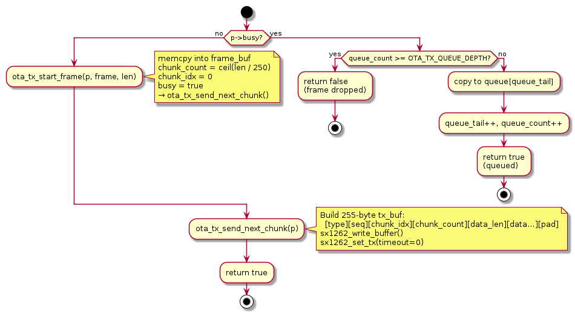
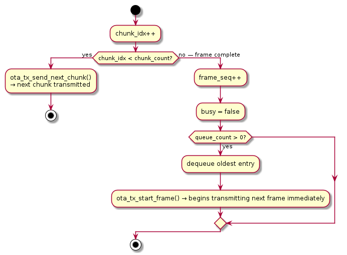
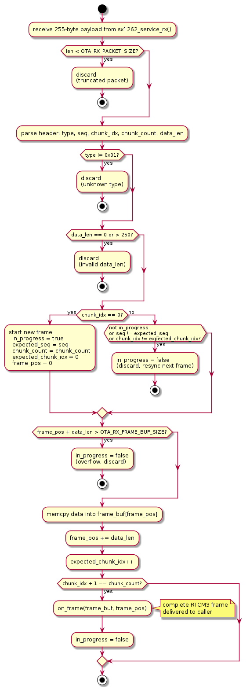
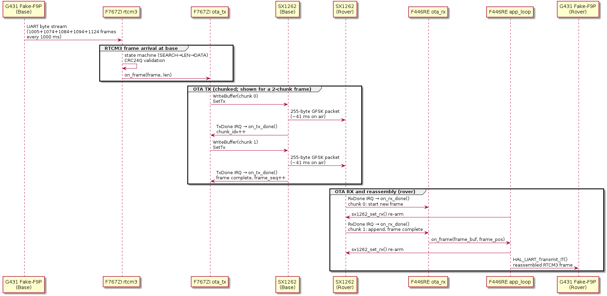

# OTA Protocol — ota_tx / ota_rx

## Overview

The OTA (Over The Air) protocol bridges the RTCM3 byte stream from the base
station's GNSS module to the rover over the 434 MHz SX1262 radio link.

RTCM3 frames are variable-length and can be up to 1029 bytes.  The SX1262
GFSK configuration uses a **fixed 255-byte packet** (SX1262 fixed-length
mode, `SX1262_GFSK_PACKET_FIXED`).  The OTA protocol slices large frames
into multiple 255-byte chunks for transmission and reassembles them on the
rover.

The protocol is split across two mirror-image modules:

| Module | Board | File |
|---|---|---|
| `ota_tx` | F767ZI (base) | `Core/Src/ota_tx.c`, `Core/Inc/ota_tx.h` |
| `ota_rx` | F446RE (rover) | `Core/Src/ota_rx.c`, `Core/Inc/ota_rx.h` |

---

## Packet Format

Every radio packet is exactly **255 bytes** (`OTA_TX_PACKET_SIZE` /
`OTA_RX_PACKET_SIZE`).

```
 0        1        2           3            4         5 … 254
┌────────┬────────┬───────────┬─────────────┬──────────┬────────────────────┐
│  type  │  seq   │ chunk_idx │ chunk_count │ data_len │  data[0..249]      │
│ 1 byte │ 1 byte │  1 byte   │   1 byte    │  1 byte  │  250 bytes         │
└────────┴────────┴───────────┴─────────────┴──────────┴────────────────────┘
  Header (OTA_TX_HEADER_SIZE = 5 bytes)          Payload (OTA_TX_DATA_SIZE = 250 bytes)
```

| Field | Width | Description |
|---|---|---|
| `type` | 1 byte | `0x01` = RTCM3 chunk.  Other values are reserved; `ota_rx` silently drops packets with unknown types. |
| `seq` | 1 byte | Frame sequence number, 0–255 wrapping.  Increments once per complete RTCM3 frame passed to `ota_tx_push_frame()`.  The rover uses this to detect a new frame restart when `chunk_idx == 0`. |
| `chunk_idx` | 1 byte | 0-based index of this chunk within the frame (first chunk = 0). |
| `chunk_count` | 1 byte | Total number of chunks for this frame.  A single-chunk frame has `chunk_idx=0`, `chunk_count=1`. |
| `data_len` | 1 byte | Number of valid RTCM3 bytes in `data[]`.  Always 250 except in the last (or only) chunk of a frame, where it equals `frame_len mod 250` (or the full frame length if ≤ 250). |
| `data[0..249]` | 250 bytes | RTCM3 frame bytes.  The last chunk is zero-padded to fill the fixed 255-byte packet. |

---

## Transmit Side: ota_tx (Base)

### Data structures

```c
// One slot in the pending-frame queue
typedef struct {
    uint8_t  buf[OTA_TX_FRAME_BUF_SIZE];  // 1032 bytes
    uint16_t len;
} ota_tx_queue_entry_t;

typedef struct {
    sx1262_t            *sx1262;
    uint8_t              frame_buf[OTA_TX_FRAME_BUF_SIZE]; // active frame copy
    uint16_t             frame_len;
    uint8_t              frame_seq;      // next sequence number to assign
    uint8_t              chunk_idx;      // next chunk to transmit
    uint8_t              chunk_count;    // total chunks for active frame
    bool                 busy;           // true while a TX is in progress
    uint8_t              tx_buf[OTA_TX_PACKET_SIZE]; // 255-byte SPI write buffer
    ota_tx_queue_entry_t queue[OTA_TX_QUEUE_DEPTH];  // 16-slot ring buffer
    uint8_t              queue_head;
    uint8_t              queue_tail;
    uint8_t              queue_count;
} ota_tx_t;
```

### Frame chunking

`ota_tx_push_frame(p, frame, len)` — the entry point called from
`on_rtcm3_frame()` in `app.c`.



`on_tx_done()` is the `sx1262_t.on_tx_done` callback, registered by
`ota_tx_init()`.  It fires after each SX1262 TxDone IRQ:



### Queue depth and capacity

`OTA_TX_QUEUE_DEPTH = 16` slots × 1032 bytes each = 16.5 KB of frame
storage (plus the 1 active frame = 17.5 KB total).  A full ZED-F9P epoch
at GPS+GLONASS (up to 5 message types × ~1 frame each) fits comfortably
with the first frame starting immediately and the remaining four queuing.

---

## Receive Side: ota_rx (Rover)

### Data structures

```c
typedef struct {
    sx1262_t *sx1262;
    void     (*on_frame)(const uint8_t *frame, uint16_t len);
    uint8_t   frame_buf[OTA_RX_FRAME_BUF_SIZE]; // 1032 bytes, reassembly buffer
    uint16_t  frame_pos;           // write cursor into frame_buf
    uint8_t   expected_seq;        // seq of the frame currently being reassembled
    uint8_t   expected_chunk_idx;  // next chunk_idx to accept
    uint8_t   chunk_count;         // chunk_count from the opening chunk
    bool      in_progress;         // true while reassembling a frame
} ota_rx_t;
```

### Reassembly logic

`on_rx_done()` is the `sx1262_t.on_rx_done` callback, registered by
`ota_rx_init()`.



### Key design: deferred, non-blocking UART TX

The `on_frame` callback in `app.c` does **not** transmit immediately.
`on_rx_done()` is called from inside `sx1262_service_rx()`, which runs
**before** `sx1262_set_rx()` re-arms the radio.  Any blocking at that point
delays re-arming and leaves the radio unready for the next OTA packet.

Instead, `on_rtcm3_frame` copies the assembled frame into `rtcm3_pending_buf`
and sets `rtcm3_pending_len`.  After `sx1262_set_rx()` re-arms the radio,
`app_loop()` copies the pending frame into a dedicated `rtcm3_tx_buf` and
starts an interrupt-driven transfer with `HAL_UART_Transmit_IT()`.
`HAL_UART_TxCpltCallback` clears `rtcm3_tx_busy` when the transfer completes.

```c
// on_rtcm3_frame — called from inside sx1262_service_rx
static void on_rtcm3_frame(const uint8_t *frame, uint16_t len) {
    memcpy(rtcm3_pending_buf, frame, len);
    rtcm3_pending_len = len;
}

void HAL_UART_TxCpltCallback(UART_HandleTypeDef *huart) {
    if(huart == &huart3) rtcm3_tx_busy = false;
}

// In app_loop() — order matters
if(flag_get_SX1262_DIO1()) {
    sx1262_service_rx(&sx1262);                              // may set rtcm3_pending_len
    sx1262_set_rx(&sx1262, SX1262_RX_TIMEOUT_CONTINUOUS);   // radio re-armed first
}
if(rtcm3_pending_len > 0 && !rtcm3_tx_busy) {
    memcpy(rtcm3_tx_buf, rtcm3_pending_buf, rtcm3_pending_len);
    rtcm3_tx_busy = true;
    HAL_UART_Transmit_IT(&huart3, rtcm3_tx_buf, rtcm3_pending_len);
    rtcm3_pending_len = 0;
}
```

`rtcm3_tx_buf` is owned by the UART until `TxCpltCallback` fires.
`rtcm3_pending_buf` is written freely by `on_rtcm3_frame` without needing
to know the UART state — the two buffers are fully independent.  A new frame
that arrives while a TX is in flight updates `rtcm3_pending_buf`; the loop
picks it up on the next iteration once `rtcm3_tx_busy` clears.

---

## End-to-End Sequence



---

## Timing Analysis

At 50 kbps GFSK, each fixed 255-byte packet occupies:

```
preamble (16 bits) + sync word (16 bits) + payload (255 × 8 bits) + CRC-16 (16 bits)
= 16 + 16 + 2040 + 16 = 2088 bits
= 2088 / 50000 = 41.8 ms on air
```

Chunk counts and approximate air time per RTCM3 message type (GPS+GLONASS
constellation, typical bench sample data):

| RTCM3 msg | Frame size | Chunks | Air time |
|---|---|---|---|
| 1005 (base position) | 25 bytes | 1 | 41.8 ms |
| 1074 (GPS MSM4) | 120 bytes | 1 | 41.8 ms |
| 1084 (GLONASS MSM4) | 69 bytes | 1 | 41.8 ms |
| 1094 (Galileo MSM4) | 300 bytes | 2 | 83.6 ms |
| 1124 (BeiDou MSM4) | 550 bytes | 3 | 125.4 ms |
| **Total per 1 Hz epoch** | **1064 bytes** | **8 packets** | **334.4 ms** |

8 packets × 41.8 ms = **334.4 ms** of air time per 1 Hz epoch, leaving
665 ms of silence per second.  This is well within Ofcom IR2030 duty cycle
limits for the 433–434 MHz SRD band (10% = 100 ms/s), and under the GM4AJK
amateur licence there is no duty cycle restriction at all.

This compares favourably to the earlier LoRa SF7/BW500 configuration which
required ~50 ms per 255-byte packet (more spreading overhead), and could not
benefit from the fixed-length packet mode as cleanly.

---

## Error Handling and Robustness

| Scenario | Behaviour |
|---|---|
| Unknown `type` byte | `ota_rx` silently discards the packet |
| Out-of-order `chunk_idx` | `ota_rx` cancels in-progress reassembly, waits for next `chunk_idx=0` |
| Wrong `seq` on a mid-frame chunk | Same as above — cancels and resyncs |
| `data_len > 250` or 0 | Packet discarded immediately |
| Frame buffer overflow | Reassembly cancelled |
| TX queue full (>16 frames) | `ota_tx_push_frame()` returns `false`, caller's frame is dropped |
| ISM interferer on 434 MHz | Packet dropped at type check; `ota_rx` stays in whatever state it was |

The most significant real-world interference observed in bench testing is a
persistent 434 MHz ISM device that transmits a 255-byte packet roughly every
61 ms with `type=0x04/0x09/...` (incrementing by 5 each cycle), `seq=0`,
`chunk_idx=1`, `chunk_count=120`.  Because `type ≠ 0x01`, these are silently
discarded by `ota_rx`.  The main risk is that an interferer packet arrives
in the SX1262 ring buffer *after* a legitimate OTA packet and before
`sx1262_service_rx()` runs, causing the legitimate packet to be overwritten.
The deferred UART TX architecture and disabled logging on the rover mitigate
this by keeping the service loop latency below the interferer's inter-packet
interval.
