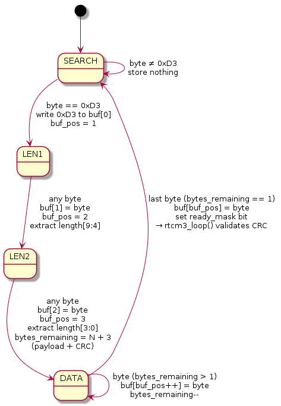
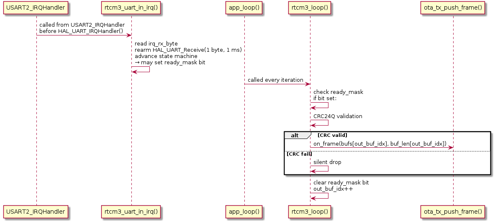

# RTCM3 Framing Module

## Purpose

`rtcm3.h` / `rtcm3.c` receives a raw RTCM3 byte stream from a UART,
delineates complete messages using the RTCM3 framing structure, validates
each message's CRC24Q checksum, and fires a caller-supplied callback for
each valid frame.  It is used on the **base station** (F767ZI) to receive
RTCM3 from the G431 Fake-F9P (or, on the real hardware, from the ZED-F9P)
and hand complete frames to `ota_tx` for radio transmission.

---

## RTCM3 Frame Format

```
 Byte 0   Byte 1         Byte 2         Bytes 3…(N+2)     Bytes (N+3)…(N+5)
┌────────┬───────────────┬───────────────┬──────────────────┬──────────────────┐
│  0xD3  │ 00 + len[9:4] │ len[3:0] + …  │  payload (N B)   │   CRC24Q (3 B)   │
└────────┴───────────────┴───────────────┴──────────────────┴──────────────────┘
 preamble   length (10 bits, big-endian, spread across bytes 1 and 2)
```

The 10-bit message length (`N`) is encoded in bytes 1–2:

- `byte[1]` bits 5:0 = `length[9:4]` (upper 6 bits); bits 7:6 are reserved (always 0).
- `byte[2]` bits 7:4 = `length[3:0]` (lower 4 bits).

Total frame size on the wire = `3 + N + 3` bytes (preamble/length header +
payload + CRC).

The first 12 bits of the payload (bytes 3–4) hold the **message type**:

```c
uint16_t msg_type = ((uint16_t)frame[3] << 4) | (frame[4] >> 4);
```

Common types used in this project (GPS+GLONASS constellation):

| Type | Description | Typical size |
|---|---|---|
| 1005 | Stationary RTK reference station ARP | 25 bytes |
| 1074 | GPS MSM4 (pseudorange + phase) | ~120 bytes |
| 1084 | GLONASS MSM4 | ~69 bytes |
| 1094 | Galileo MSM4 | ~300 bytes |
| 1124 | BeiDou MSM4 | ~550 bytes |

---

## State Machine

The RTCM3 framing state machine runs entirely inside `rtcm3_uart_in_irq()`,
which is called from the UART IRQ handler once per received byte.



States are defined in `rtcm3_irq_state_t`:

```c
typedef enum {
    RTCM3_ST_SEARCH,  // scanning for 0xD3 preamble
    RTCM3_ST_LEN1,    // first length byte
    RTCM3_ST_LEN2,    // second length byte; also computes byte count
    RTCM3_ST_DATA,    // accumulating payload + CRC bytes
} rtcm3_irq_state_t;
```

---

## Buffer Pool

```c
#define RTCM3_BUF_COUNT  4
#define RTCM3_BUF_SIZE   2048

typedef struct {
    UART_HandleTypeDef        *uart_f9p;
    void (*on_frame)(const uint8_t *frame, uint16_t len);
    uint8_t  bufs[RTCM3_BUF_COUNT][RTCM3_BUF_SIZE]; // 4 × 2048 = 8 KB
    uint16_t buf_len[RTCM3_BUF_COUNT];
    volatile int              in_buf_idx;   // written by IRQ
    int                       out_buf_idx;  // read by idle loop
    volatile uint8_t          ready_mask;   // bit N set when bufs[N] is full and unread
    uint8_t                   irq_rx_byte;
    volatile rtcm3_irq_state_t irq_state;
    volatile uint16_t          irq_bytes_remaining;
    volatile uint16_t          irq_buf_pos;
} rtcm3_t;
```

The IRQ fills whichever buffer `in_buf_idx` points at.  When a complete
frame is stored the corresponding bit in `ready_mask` is set and `in_buf_idx`
advances to the next slot (mod 4).  The idle loop reads from `out_buf_idx`,
which advances independently after processing.

`ready_mask` is `volatile` but not atomic because the IRQ only ever **sets**
bits (via `in_buf_idx`) and the loop only ever **clears** bits (via
`out_buf_idx`), and those two indices always reference different slots while
work is pending.  The two sides never race on the same bit, so `volatile`
alone is sufficient to prevent the compiler from caching `ready_mask` in a
register across loop iterations.  (Compare with `flags.c`, where IRQ and
loop share the same bit and true atomics are required.)

Frames arriving when all four slots are full are silently dropped.

---

## IRQ / Loop Split



`rtcm3_uart_in_irq()` is called from `USART2_IRQHandler` **before**
`HAL_UART_IRQHandler()` so the received byte is captured while RXNE is still
set.  Inside the function, `HAL_UART_Receive()` (blocking, 1 ms timeout) is
called to re-arm reception of the next byte before the state machine processes
the current one.

> **Known startup artefact**: on the very first IRQ firing, `irq_rx_byte`
> holds its initial zero value — the state machine processes a corrupted first
> byte.  The first frame therefore always fails CRC and is silently dropped.
> Every subsequent frame is unaffected.

---

## CRC24Q

RTCM3 uses the **CRC24Q** algorithm (polynomial `0x1864CFB`, 24-bit output).
The CRC covers the three-byte header (0xD3 + length) and the entire payload.
`rtcm3_loop()` recomputes the CRC over `buf[0..frame_len-4]` and compares
it to the three CRC bytes at the end of the frame.  Frames that fail are
silently dropped.

```c
static uint32_t crc24q(const uint8_t *buf, size_t len)
{
    uint32_t crc = 0;
    for(size_t i = 0; i < len; i++) {
        crc ^= (uint32_t)buf[i] << 16;
        for(int j = 0; j < 8; j++) {
            crc <<= 1;
            if(crc & 0x1000000) crc ^= 0x1864CFB;
        }
    }
    return crc & 0xFFFFFF;
}
```

---

## Integration Checklist

1. **Declare the instance at file scope (non-static)** in `app.c` so that
   `stm32f7xx_it.c` can reach it via `extern`:
   ```c
   rtcm3_t rtcm3;        // in app.c
   extern rtcm3_t rtcm3; // in stm32f7xx_it.c
   ```

2. **Initialise** from `app_init()` after all `MX_*_Init()` calls:
   ```c
   rtcm3_init(&rtcm3, &huart2, on_rtcm3_frame);
   ```
   `rtcm3_init()` arms `HAL_UART_Receive_IT()` for the first byte.  The
   UART's NVIC interrupt must already be enabled by CubeMX.

3. **Wire the IRQ** — add to `stm32f7xx_it.c` inside `USART2_IRQHandler`,
   in the `USER CODE BEGIN USART2_IRQn 0` section (before `HAL_UART_IRQHandler`):
   ```c
   rtcm3_uart_in_irq(&rtcm3);
   ```

4. **Service the loop** — call from every `app_loop()` iteration:
   ```c
   rtcm3_loop(&rtcm3);
   ```

---

## Buffer Sizing

`RTCM3_BUF_SIZE = 2048` bytes accommodates the maximum RTCM3 frame:
3 (header) + 1023 (max 10-bit length) + 3 (CRC) = 1029 bytes, with 1019
bytes of headroom.

`RTCM3_BUF_COUNT = 4` buffers give the idle loop time to process one frame
while up to three more arrive back-to-back.  With a typical 1 Hz F9P epoch
of five frames totalling ~1064 bytes, two back-to-back frames at 115200 baud
take ~185 ms — well within the 1000 ms epoch period even with the
`ota_tx` queue absorbing the burst.

**Future PCB risk**: 4 is sufficient while the main loop is lightweight
(radio SPI only).  Once the PCB adds a display and SD card, long blocking
operations in the loop could exhaust the pool.  SD card writes should use
DMA to stay non-blocking.  Display updates are the bigger concern: an SSD1309
flush over I2C at 400 kHz takes ~33 ms for a full 128×64 frame; a larger
display or slower bus could push this higher.  If any single blocking segment
in the loop can exceed ~73 ms (the time for 4 × average-frame to arrive back
to back at 115200 baud), frames will be silently dropped.  Bump
`RTCM3_BUF_COUNT` to 8 before adding the display driver — it costs only
16 KB on the F765's 512 KB RAM and eliminates the risk entirely.
