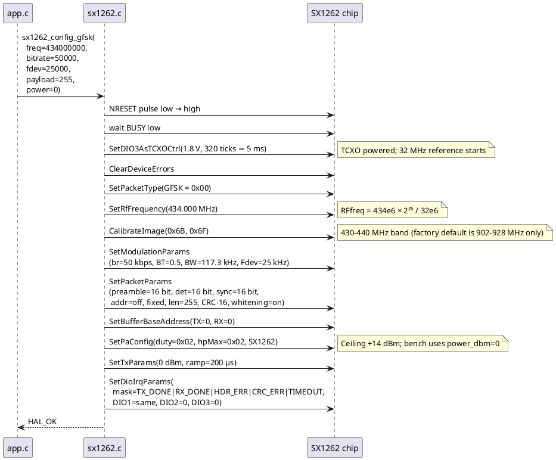
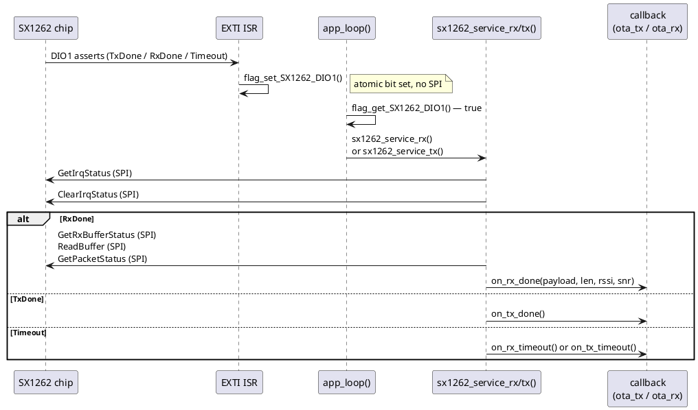

# SX1262 Driver

## Purpose

`sx1262.h` / `sx1262.c` is a thin, HAL-based SPI wrapper around the Semtech
SX1262 transceiver's command set (datasheet §13).  It covers the subset of
commands needed for GFSK fixed-packet TX/RX: reset, configuration, buffer
access, TX/RX arming, and IRQ status.  LoRa modulation parameters are also
wired up from an earlier bring-up phase but are not used in the current bench
configuration.

Each firmware project (F767ZI, F446RE) keeps its own copy of the driver
files under `Core/Inc/` and `Core/Src/`.  The copies are identical except
that `SX1262_WITH_LOGGING` is **enabled on the base** (F767ZI) and
**disabled on the rover** (F446RE) — see the Timing section below.

---

## Struct and Callbacks

```c
typedef struct sx1262_s {
    SPI_HandleTypeDef *port;
    GPIO_PIN_DEF(cs_port,    cs_pin);    // NSS, active low
    GPIO_PIN_DEF(reset_port, reset_pin); // NRESET, active low
    GPIO_PIN_DEF(busy_port,  busy_pin);  // BUSY, input

    uint8_t packet_type;                 // last SetPacketType value

    // Event callbacks — all NULL after sx1262_init()
    void (*on_rx_done)(sx1262_t *p, const uint8_t *payload, size_t len,
                       int8_t rssi, int8_t snr_quarter_db);
    void (*on_tx_done)(sx1262_t *p);
    void (*on_rx_timeout)(sx1262_t *p);
    void (*on_tx_timeout)(sx1262_t *p);

#ifdef SX1262_WITH_LOGGING
    void (*on_log)(const char *buf, int len);  // compiled out when disabled
#endif
} sx1262_t;
```

The caller owns the `sx1262_t` instance (typically `static` in `app.c`).
`sx1262_init()` stores SPI and GPIO handles and zeroes all callbacks — it
does **not** touch any pins or issue any SPI transactions.  The hardware is
not touched until `sx1262_config_gfsk()` (or a manual bring-up sequence) is
called.

### Callback registration

| Setter | Field set | Fired by |
|---|---|---|
| `sx1262_set_rx_done_callback()` | `p->on_rx_done` | `sx1262_service_rx()` on RxDone IRQ |
| `sx1262_set_tx_done_callback()` | `p->on_tx_done` | `sx1262_service_tx()` on TxDone IRQ |
| `sx1262_set_rx_timeout_callback()` | `p->on_rx_timeout` | `sx1262_service_rx()` on Timeout IRQ |
| `sx1262_set_tx_timeout_callback()` | `p->on_tx_timeout` | `sx1262_service_tx()` on Timeout IRQ |
| `sx1262_set_logger_callback()` | `p->on_log` | Internally throughout the driver (only when `SX1262_WITH_LOGGING`) |

The `on_rx_done` callback receives a pointer to the received payload that is
only valid for the duration of the call.  Callers must copy any data they
need to retain.

---

## GFSK Bring-Up Sequence

`sx1262_config_gfsk()` is a convenience function that runs the complete
bring-up sequence in one call.  The sequence matters — in particular,
`SetDIO3AsTCXOCtrl` must come first on the Waveshare Core1262-LF module
because the 32 MHz reference TCXO is powered from DIO3; without it the chip
cannot leave `STBY_RC` and `XOSC_START_ERR` is set.



After `sx1262_config_gfsk()` returns, the caller registers its TX/RX
callbacks (`ota_tx_init()` registers `on_tx_done`; `ota_rx_init()` registers
`on_rx_done`) and then arms the radio:

- **Base**: calls `sx1262_set_tx()` indirectly via `ota_tx_push_frame()` whenever a frame is ready.
- **Rover**: calls `sx1262_set_rx(SX1262_RX_TIMEOUT_CONTINUOUS)` once from `app_loop()` before entering the main loop, then re-arms after every received packet.

---

## Interrupt Model

DIO1 is routed to an EXTI line on both boards.  The ISR sets a flag atomically
rather than doing any SPI work.  All SPI access happens in the cooperative
idle loop, keeping ISR latency minimal.



**Key constraint**: no SPI call may be made from the EXTI ISR or from inside
any other ISR.  SPI HAL calls may block waiting for `BUSY` to clear
(`SX1262_BUSY_TIMEOUT_MS = 1000 ms`) and are not interrupt-safe.

---

## BUSY Line Protocol

The SX1262 asserts BUSY high while processing a command and while booting
after reset.  Every driver function that issues an SPI transaction calls
`sx1262_wait_busy()` first, which polls the BUSY GPIO until it reads low
or `SX1262_BUSY_TIMEOUT_MS` (1000 ms) elapses.  Exceeding the timeout
returns `HAL_TIMEOUT`; callers at the `sx1262_config_gfsk()` level treat
any non-`HAL_OK` return as a fatal hardware fault.

---

## Timing: Why Logging is Disabled on the Rover

Each call to the logger callback sends a formatted string over UART at 115200
baud — roughly 3–7 ms per packet depending on message length.  On the base
this is harmless.  On the rover, logging fires inside `sx1262_service_rx()`
**before** `sx1262_set_rx()` re-arms the radio.  Combined with the 47.8 ms
blocking UART TX of an assembled 1124-byte RTCM3 frame, the total blocking
window without the logging fix reached ~66 ms — long enough for a 434 MHz
ISM interferer to arrive and displace a 1005 RTCM3 chunk in the SX1262 ring
buffer before `service_rx` could read it.  Disabling logging on the rover
reduces the window to ~51 ms, well below the ~61 ms interferer period.

---

## API Reference

### Lifecycle

```c
void sx1262_init(sx1262_t *p, SPI_HandleTypeDef *port,
                 GPIO_TypeDef *cs_port,    uint16_t cs_pin,
                 GPIO_TypeDef *reset_port, uint16_t reset_pin,
                 GPIO_TypeDef *busy_port,  uint16_t busy_pin);
```
Stores handles; no hardware access.

```c
HAL_StatusTypeDef sx1262_reset(sx1262_t *p);
```
Pulses NRESET low → high then waits for BUSY to clear.

```c
HAL_StatusTypeDef sx1262_config_gfsk(sx1262_t *p,
    uint32_t freq_hz, uint32_t bitrate_bps, uint32_t fdev_hz,
    uint8_t payload_len, int8_t power_dbm);
```
Full GFSK bring-up in one call.  Does **not** register TX/RX callbacks.

### Configuration (low-level)

| Function | SX1262 command |
|---|---|
| `sx1262_set_packet_type()` | SetPacketType (0x8A) |
| `sx1262_set_rf_frequency()` | SetRfFrequency (0x86) |
| `sx1262_calibrate_image()` | CalibrateImage (0x98) |
| `sx1262_set_dio3_as_tcxo_ctrl()` | SetDIO3AsTCXOCtrl (0x97) |
| `sx1262_set_modulation_params_gfsk()` | SetModulationParams (0x8B, GFSK) |
| `sx1262_set_modulation_params_lora()` | SetModulationParams (0x8B, LoRa) |
| `sx1262_set_packet_params_gfsk()` | SetPacketParams (0x8C, GFSK) |
| `sx1262_set_packet_params_lora()` | SetPacketParams (0x8C, LoRa) |
| `sx1262_set_pa_config()` | SetPaConfig (0x95) |
| `sx1262_set_tx_params()` | SetTxParams (0x8E) |
| `sx1262_set_buffer_base_address()` | SetBufferBaseAddress (0x8F) |
| `sx1262_set_dio_irq_params()` | SetDioIrqParams (0x08) |

### Buffer access

```c
HAL_StatusTypeDef sx1262_write_buffer(sx1262_t *p, uint8_t offset,
                                      const uint8_t *data, size_t len);
HAL_StatusTypeDef sx1262_read_buffer(sx1262_t *p, uint8_t offset,
                                     uint8_t *out_data, size_t len);
```

### TX / RX arming

```c
HAL_StatusTypeDef sx1262_set_tx(sx1262_t *p, uint32_t timeout);
HAL_StatusTypeDef sx1262_set_rx(sx1262_t *p, uint32_t timeout);
```
`timeout` is in steps of 15.625 µs.  Pass `SX1262_RX_TX_TIMEOUT_NONE` (0)
for no timeout, or `SX1262_RX_TIMEOUT_CONTINUOUS` (0xFFFFFF) for continuous
RX mode.

### IRQ servicing

```c
bool sx1262_service_tx(sx1262_t *p);
bool sx1262_service_rx(sx1262_t *p);
```
Call from the idle loop when `flag_get_SX1262_DIO1()` is set.  Returns
`true` if the event was TxDone/RxDone, `false` on Timeout or error.

### Status / diagnostics

```c
HAL_StatusTypeDef sx1262_get_status(sx1262_t *p, uint8_t *out_status);
HAL_StatusTypeDef sx1262_get_irq_status(sx1262_t *p, uint16_t *out_irq);
HAL_StatusTypeDef sx1262_clear_irq_status(sx1262_t *p, uint16_t clear_mask);
HAL_StatusTypeDef sx1262_get_device_errors(sx1262_t *p, uint16_t *out_errors);
HAL_StatusTypeDef sx1262_clear_device_errors(sx1262_t *p);
HAL_StatusTypeDef sx1262_get_packet_status(sx1262_t *p,
    int8_t *out_rssi_pkt, int8_t *out_snr_pkt_quarter_db);
HAL_StatusTypeDef sx1262_get_packet_status_gfsk(sx1262_t *p,
    uint8_t *out_rx_status, int8_t *out_rssi_sync, int8_t *out_rssi_avg);
HAL_StatusTypeDef sx1262_get_rx_buffer_status(sx1262_t *p,
    uint8_t *out_payload_len, uint8_t *out_start);
```

---

## Hardware Notes: Waveshare Core1262-LF

- DIO3 powers the 32 MHz TCXO — `SetDIO3AsTCXOCtrl` is mandatory.
- Operating at 434 MHz requires `CalibrateImage(0x6B, 0x6F)` (430–440 MHz band);
  factory calibration only covers 902–928 MHz.
- TX/RX enable lines (TxENABLE / RxENABLE) are present on this module's
  schematic and wired to the STM32, but they are not toggled in firmware —
  the SX1262 controls them internally via DIO2 in `SetDIO2AsRfSwitchCtrl`
  mode.  The current driver does not call `SetDIO2AsRfSwitchCtrl`; TX and RX
  both work because the module's RF switch defaults to a safe state.  This
  is a known gap to revisit if TX power or RX sensitivity needs tuning.
