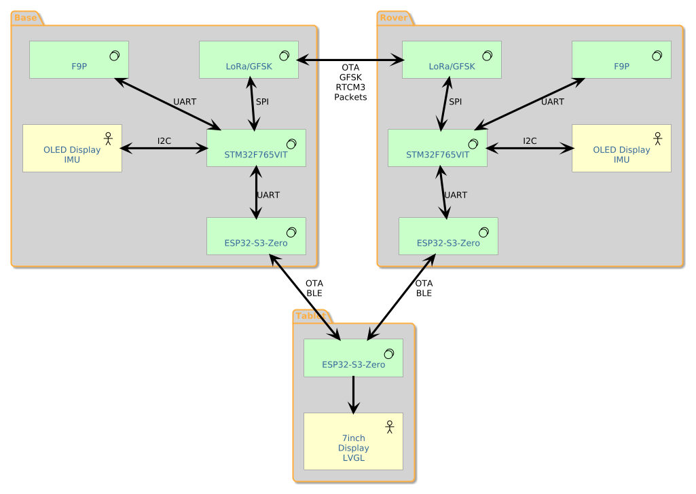

# System Architecture — GPS Survey Staff

## Overview

A DIY RTK GNSS survey staff built around the u-blox ZED-F9P-05B module on a custom carrier PCB.
Two identical PCBs — one configured as base station, one as rover — communicate via LoRa.
Centimetre-level relative accuracy is the target.

---

## System Diagram



```
BASE STATION [identical PCB]          ROVER (staff/pole) [identical PCB]
+-------------------------+           +-------------------------+
|  ZED-F9P (base mode)    |           |  ZED-F9P (rover mode)   |
|  RTCM out on UART       |           |  receives RTCM, RTK fix |
+--------+----------------+           +--------+----------------+
         | UART                                | UART
+--------v----------------+  LoRa RTCM -->   +--------v----------------+
|   STM32F765VIT6         |  <-- LoRa CMD    |   STM32F765VIT6         |
|   RTCM reader, LoRa TX  |                  |   RTCM->F9P, SD log     |
|   survey-in control     |                  |   OLED: tilt/fix/status |
+--------+----------------+                  +--------+----------------+
         | UART (RTCM)                                | UART
+--------v----------------+                +----------v--------------+
|   ESP32-S3 Zero         |                |   ESP32-S3 Zero         |
|   WiFi → NTRIP caster   |                |   BLE 5.0 GATT server   |
|   BLE WiFi provisioning |                |   (position, status,    |
+--------+----------------+                |    command channel)     |
         v                                 +----------+--------------+
  NTRIP caster                                        | BLE
  (RTK2GO, Emlid, etc.)                   +----------v--------------+
                                          |   Handheld data         |
                                          |   collector             |
                                          |   4.3" ESP32-S3 (HH)   |
                                          |   7" ESP32-S3 (tablet)  |
                                          +-------------------------+
```

- Single PCB design; identical STM32 firmware on both units; mode (base/rover) selected by hardware jumper at boot
- Different ESP32-S3 Zero firmware per role — same module on both PCBs
- F9P handles all RTK computation onboard — STM32F7 is smart pipe + data logger

---

## Unit Roles

| Unit | Firmware | Role |
|------|----------|------|
| Base station | `rtk-base` + `esp32-base` | Surveys-in, enters fixed mode, TX RTCM over LoRa; streams RTCM to NTRIP caster over WiFi in gateway mode |
| Rover (staff) | `rtk-base` (rover mode) + `esp32-base` (rover role) | Receives RTCM from Base, passes to F9P, logs RTK-corrected positions to SD card |
| Handheld (4.3") | `esp32-handheld` | Survey UI: position readout, WiFi provisioning for Base, session management |
| Tablet (7") | `esp32-tablet` (TBD, arriving ~2026-07-01) | Full-resolution survey UI on 1024×600 display |

For detailed implemented capabilities, see:
[BASE.md](BASE.md) · [ROVER.md](ROVER.md) · [HANDHELD.md](HANDHELD.md)

---

## Key Technology Decisions

### GNSS: ZED-F9P-05B

L1/L2 dual-frequency RTK module. Handles all RTK computation onboard; STM32 is a data pipe.
RTCM constellation: GPS + GLONASS only — reduces 1Hz stream from ~700 bytes (4-GNSS) to
~255-325 bytes, fitting 2 SX1262 LoRa packets instead of 3-4.

### MCU: STM32F765VIT6

100-pin LQFP, 2MB flash, 512KB RAM, 216MHz Cortex-M7. Same F7 family as the Nucleo-F767ZI
dev board — firmware port to PCB is pin reassignment only. Single unified PCB for both
base and rover; mode selected by jumper.

### Radio: SX1262 (Waveshare Core1262-LF, 410-510MHz)

22dBm output, -148dBm sensitivity — massively over-specified for 100m working range.
SF7/BW500: ~25ms time-on-air, ~2.5% duty cycle at 1Hz — within ISM no-duty-cycle sub-band
(434.04-434.79MHz, 10mW). Full 22dBm available under GM4AJK amateur licence on 70cm band.

**Regulatory basis:** The project at SF7/BW500/+22dBm does not fit IR2030/1/10 (10mW limit),
IR2030/1/11 (1mW limit), or IR2030/1/12 (BW ≤ 25kHz required for 100% duty cycle). Operation
is under the GM4AJK amateur radio licence on the 70cm band. See `docs/datasheets/Ofcom-IR-2030.pdf`.

### BLE / WiFi Coprocessor: ESP32-S3 Zero

Fitted on both PCBs (identical build); firmware differs by role.
Base: WiFi NTRIP gateway + BLE WiFi provisioning server.
Rover: BLE 5.0 GATT server to handheld (position, status, command channel).

### Power: TPS63020 + BQ24075

TPS63020 buck-boost gives stable 3.3V across full LiPo discharge curve.
BQ24075 provides power-path management — USB-C 5V charging and operation simultaneously,
no glitch on hot-plug. EN1/EN2 firmware-controlled for USB current negotiation.

### IMU: LSM6DSRX + MMC5603NJ

LSM6DSRX (6-DOF) for tilt; MMC5603NJ for magnetic heading.
Combined purpose: pole lean correction — computes horizontal offset of ground contact point
when pole is not perfectly vertical.

Lean correction (simplified):
```
gravity = normalize(accel_xyz)
tilt_angle = arccos(gravity.z)
tilt_azimuth = heading + arctan2(gravity.y, gravity.x)
offset = pole_height × sin(tilt_angle)
```

At 2m pole height: 1° lean = 35mm uncorrected error; IMU correction reduces residual to ~3.5mm.

MMC5603NJ replaces the obsolete LIS3MDL (no longer purchasable). Connected via MMC560x-B
sub-board (J11) — avoids hand-soldering the 0.8mm WLP die.

### Data Logging: SDMMC 4-bit + FatFS

SDMMC1 on fixed AF pins (PC8-12/PD2). 4-bit bus chosen for USB MSC read path throughput;
SD write at 1Hz is trivially low for any interface. FatFS + STM32 HAL SDMMC + DMA.

### Configuration Storage: SD Card

Config file on SD card (pole height, LoRa band, calibration coefficients). No EEPROM.
VBAT wired directly to 3.3V — backup domain available while powered, lost on power-off;
no cross-power-cycle retention needed since config is on SD.

---

## System Architecture — Three-Tier, Split-Brain App

### Three-tier hardware abstraction

Each field unit (Base and Rover) has the same two-chip structure:

```
┌─────────────────────────────────────────────────────────────────┐
│  HARDWARE LAYER — STM32F765VIT6                                  │
│  Owns all hardware buses. Exposes services and accepts commands  │
│  via UART protocol. Has no knowledge of BLE, app state or UI.   │
│                                                                  │
│  F9P (2× UART) · SX1262 (SPI) · SDMMC · I2C (OLED + IMU)      │
│  Power mgmt GPIO · Battery ADC · LEDs · USB OTG                 │
└───────────────────────┬─────────────────────────────────────────┘
                        │ UART — hardware abstraction protocol
┌───────────────────────▼─────────────────────────────────────────┐
│  APPLICATION LAYER — ESP32-S3-Zero                               │
│  Owns all application state and logic. Commands the STM32.      │
│  Consumes telemetry forwarded by STM32 (UBX parsed to simple    │
│  binary messages). Serves BLE GATT to the Tablet.               │
│                                                                  │
│  BASE: operating mode state machine · survey-in control ·       │
│        WiFi NTRIP gateway · BLE GATT server (Base Config)       │
│  ROVER: position/fix state · RTCM lock status ·                 │
│         BLE GATT server (Rover status to Tablet)                │
└─────────────────────────────────────────────────────────────────┘
```

The STM32 UART protocol is a **hardware abstraction boundary** — not byte-passing.
The STM32 exposes services (parsed GNSS data, LoRa TX, OLED rendering, IMU readings)
and accepts commands (start survey-in, send RTCM packet, show display message),
hiding all bus-level complexity (UBX framing, SPI timing, SDMMC DMA, I2C) from the
application layer entirely.

---

### Split-brain application across three ESP32-S3 devices

The application as experienced by the user is distributed across three ESP32-S3s:

```
┌──────────────────────────────────────────────────────────────┐
│  TABLET ESP32-S3  (4.3" handheld or 7" tablet)              │
│  UI layer — LVGL display, user interaction, screen routing.  │
│  Connects to Base ESP32 (BLE, temporary) for config.        │
│  Connects to Rover ESP32 (BLE, permanent) for live data.    │
└───────────┬──────────────────────────────┬───────────────────┘
            │ BLE (temporary, UI-driven)   │ BLE (permanent)
┌───────────▼───────────────┐  ┌───────────▼───────────────────┐
│  BASE ESP32-S3-Zero       │  │  ROVER ESP32-S3-Zero           │
│  App layer — base side.   │  │  App layer — rover side.       │
│  Operating mode s/m.      │  │  Fix quality, RTCM lock.       │
│  Survey-in control.       │  │  Position data relay.          │
│  GATT: Base Config svc.   │  │  GATT: Rover status svc.       │
│  WiFi NTRIP gateway.      │  │  Receives Base battery %       │
│                           │  │  via GFSK → STM32 → UART.     │
└───────────────────────────┘  └───────────────────────────────┘
```

No single ESP32 holds the complete application state — it is intentionally split:
- **Base ESP32** knows what the Base is doing (mode, survey-in progress, NTRIP status).
- **Rover ESP32** knows what the Rover is doing (RTK fix quality, RTCM lock, battery).
- **Tablet ESP32** knows what the user is doing (which screen, what they last tapped).

The Tablet is the only device that sees the full picture, assembled at runtime from
BLE data received from both field units. Each field unit's ESP32 is authoritative for
its own state only; neither talks directly to the other's ESP32.

State is held in ESP32 RAM only. All three units share power with their respective
STM32 (or have no STM32 in the Tablet's case). Power cycle = clean start on any unit;
no NVS persistence is required or expected.

---

## Firmware Projects

Three CubeIDE projects (STM32 hardware layer):

| Project | Target | Role |
|---------|--------|------|
| `rtk-base` | STM32F765VIT6 (custom PCB) | Hardware layer — base and rover mode in one binary |
| `rtk-sandbox` | STM32F765VIT6 (custom PCB) | CubeMX code reference — never flashed |
| `Nucleo-F767ZI` | STM32F767ZI (Nucleo-144) | Hardware sandbox — bench-test peripherals before porting |

Three IDF projects (ESP32 application layer):

| Project | Target | Role |
|---------|--------|------|
| `esp32-base` | ESP32-S3-Zero | Base application layer — GATT server, WiFi NTRIP, mode state machine |
| `esp32-handheld` | ESP32-S3 4.3" | Tablet UI layer — LVGL, BLE client to Base + Rover |
| `esp32-tablet` | ESP32-S3 7" | Tablet UI layer (higher resolution) — same role as handheld |

Note: there is no separate `esp32-rover` project yet — Rover ESP32 firmware is TBD.

CubeMX owns in `rtk-base`: clock tree, mode-select GPIO, debug UART, SWO. Everything
else is application-owned, initialised at register level. No `MX_*_Init()` beyond
those four. The app reads the mode jumper at boot and brings up only the peripherals
the physical assembly has.

Full STM32 firmware module documentation: [`docs/arch/`](../../docs/arch/)

---

## Status Beacon Protocol

**Terminology used throughout this section:**
- **Long-haul link** — the link the remote device uses to send data (RF in Mode 1, TCP internet in Mode 5). Carries RTCM and status beacons.
- **Short-haul link** — local BLE between a field unit's ESP32 and the Tablet.

The remote device (Base in Mode 1 / Mode 5A, Rover in Mode 5B) sends a small
status packet every **10 seconds** over the long-haul link. This is the mechanism
by which the Tablet's status bar shows remote battery %.

### Transport

| Mode | Direction | Mechanism |
|------|-----------|-----------|
| Mode 1 (RF) | Base → Rover (long-haul) | Interleaved in GFSK stream alongside RTCM. Rover STM32 deframes it and routes to Rover ESP32 via UART (`MSG_STATUS_BEACON`). Rover ESP32 forwards to Tablet over short-haul BLE GATT notify. |
| Mode 5 (TCP) | Remote → Mobile (long-haul) | Sent in reverse direction on the same open TCP socket. Mobile ESP32 receives directly — no STM32 involvement. Tablet reads via short-haul BLE from the mobile ESP32. |
| Modes 2/3/4 | — | No long-haul link between devices. Status bar shows `—` for remote device. |

### Framing

Status packets are interleaved with RTCM bytes on the same byte stream (RF or TCP).
RTCM3 packets are identified by sync byte `0xD3`. Status packets use a distinct magic
that cannot occur as a valid RTCM3 sync:

```
┌────────┬────────┬────────┬──────────────────────┬────────┐
│ 0xAA   │ 0x55   │ LEN    │ PAYLOAD (LEN bytes)  │ CRC-8  │
│ magic0 │ magic1 │ uint8  │                      │        │
└────────┴────────┴────────┴──────────────────────┴────────┘
```

The RTCM/status deframer checks each sync byte: `0xD3` → RTCM path, `0xAA` (+`0x55` confirmation) → status path.

### Payload (~8 bytes)

| Offset | Field | Type | Notes |
|--------|-------|------|-------|
| 0 | `device_id` | uint8 | `0x01` = Base, `0x02` = Rover |
| 1 | `battery_pct` | uint8 | 0–100, from STM32 ADC |
| 2 | `fix_type` | uint8 | `0` = none, `1` = float, `2` = RTK fix |
| 3–4 | `hacc_mm` | uint16 LE | Horizontal accuracy from UBX-NAV-PVT (mm) |
| 5 | `rtcm_rate` | uint8 | RTCM messages/sec output (0 if not streaming) |
| 6–7 | `uptime_s` | uint16 LE | Seconds since power-on |

Total wire size: 2 (magic) + 1 (len) + 8 (payload) + 1 (CRC) = **12 bytes**.

### Timing and fault tolerance

- Transmitted every 10 s in the inter-epoch gap (RTCM is 1 Hz; ≥900 ms of dead air available).
- Tablet status bar goes grey and shows `—` if 3 consecutive packets are missed (30 s timeout).
- A missed packet does not trigger any alert or retry.

---

## RTK Concepts

- **Code-phase** (consumer GPS): ~1-5m — noise floor cannot be corrected below ~1m
- **Carrier-phase** (RTK): mm measurement noise — resolves integer ambiguity for cm positions
- **RTK base position**: affects *absolute* accuracy only, not *relative* accuracy between points
  - Unknown base: cm relative accuracy, offset absolute position
  - Known base (benchmark / NTRIP): cm absolute accuracy in OS datum
- **NTRIP**: UK correction networks available (OS Net) for absolute coordinate accuracy
